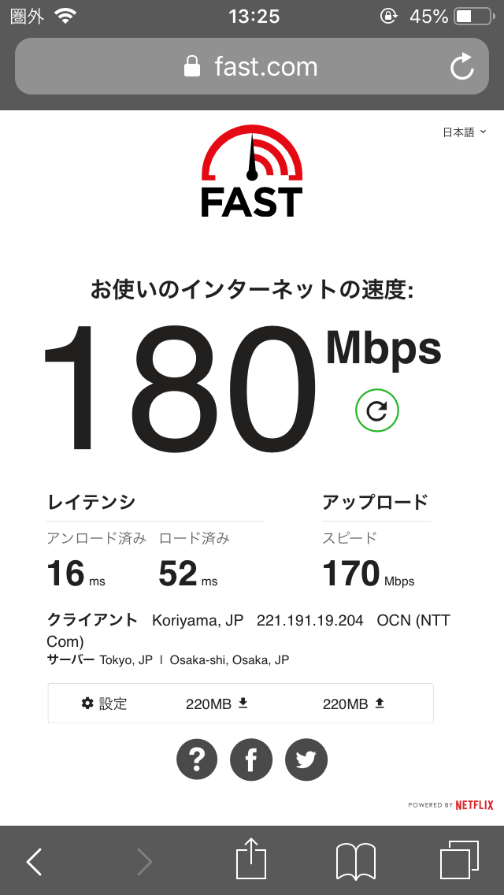
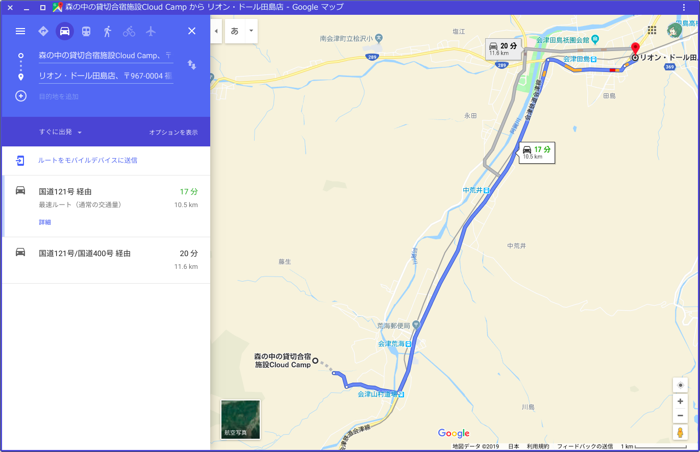
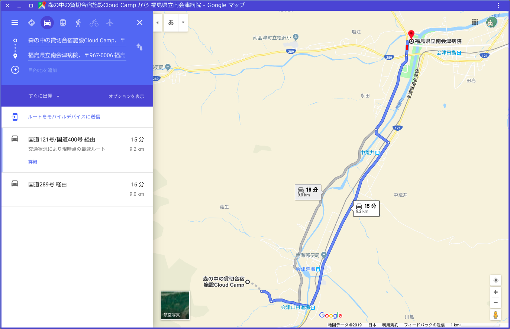

# 下見メモ
2019/06/23 18:15 作成：櫛田一樹
## 1. ネットワーク環境
### 1-1.無線ネットワーク環境
有  
速度：180Mbps (環境により変化あり)

### 1-2.有線ネットワーク環境
ポート有  
ネットワークハブ有

### 1-3.キャリア回線
絶望的…?

## 2.食事について

### 2-1.前例
> 会津大では朝飯おにぎり2個350円くらいの相談があった。  
> 先方で注文も行っていただけるらしい。

### 2-2.食事
- 昼
  - 調理班がおにぎり作成
- 夜
  - 初日
    - BBQ
    - 30人で5つのBBQ台を使うこと推奨
  - それ以降
    - ***検討中***
    - カレーとか野菜炒めとか？？

## 3.下見で確認した事柄
- 椅子,机が人数分存在するか
  - ありそう  
- 12時以降に食堂の机を持ち出すことは可能か
  - 可能
- 他の机を借りることは可能か
  - 可能
  - 長机4台
  - いつでもミーティングルームの机,椅子持ち出し可能
  - ミーティングルーム外での食事も可能
- プロジェクター,スクリーン等備品数
  - 1セット
  - 不足気味になる場合あり
    - その場合サークルのものを持って行く等対策が必要
  - ホワイトボート2枚(**縦長**)
- スーパーへの道順
  
  - 道は一応OKらしい
  - 一番近いスーパーは[リオン・ドール田島店](https://goo.gl/maps/38WktDb68asNxCcL7)？？
- コピー機
  - 100枚程度になると別途料金必要
    - その場合データをUSBに入れて先方で印刷してもらう
- 付近の病院
  - [福島県立南会津病院](https://goo.gl/maps/QasvPGZEH91fq8Aa9)
  - 病院への道順と所要時間
  
- 弁当屋(300円〜400円でお願いできるところ)
  - 可能であれば現地へ
  - 電話可
  - 15人〜30人程度の発注は可能か要確認
- シャンプーの有無
  - シャンプー,ボディーソープ共に完備
  - ドライヤー完備

## 4.その他告知事項等
- タオル,バスタオル有料
- 歯ブラシ,エアブラシ(アメニティ系無料)
- 携帯は要充電器
- 南会津町の助成金申請の際**領収書必要**
- 野外音楽堂が下にある
- 旧テニスコートでドローンを飛ばした前例がある
- ***キャンセルの際は3日前までに要連絡***

## 5.下見画像
.jpg)  
.jpg)  
.jpg)  
.jpg)  
.jpg)  
.jpg) 
.jpg)   
.jpg)  
.jpg)  
.jpg)  
.jpg)  
.jpg)  
.jpg)  
.jpg)  
.jpg)  
.jpg)  
.jpg) 
.jpg)   
.jpg)  
.jpg)  